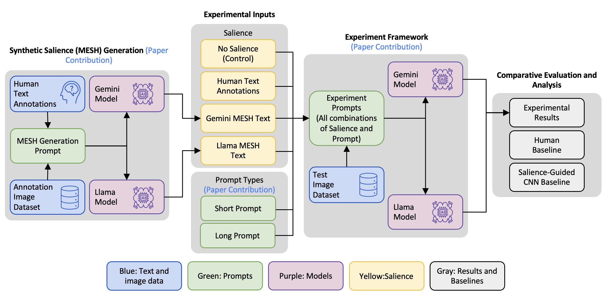
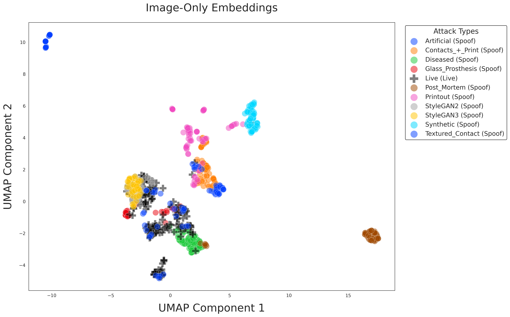
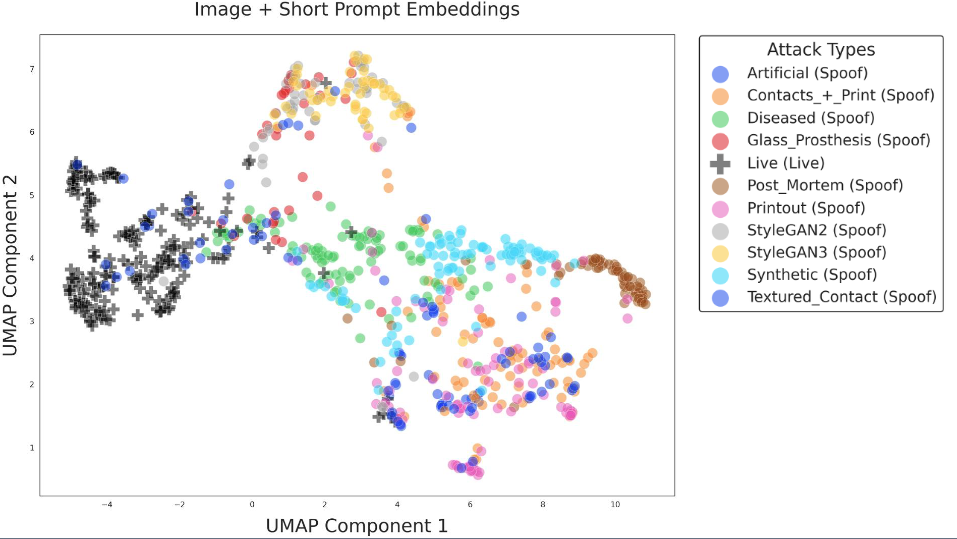

# Generalist Multimodal LLMs Gain Biometric Expertise via Human Salience for Iris Presentation Attack Detection

Official repository for the IEEE Access paper: **[IEEEXplore](https://ieeexplore.ieee.org/document/11510259) | [ArXiv](https://arxiv.org/abs/2603.17173)**

## Abstract
> Iris presentation attack detection (PAD) is critical for secure biometric deployments, yet developing specialized models faces significant practical barriers: collecting data representing future unknown attacks is impossible, and collecting diverse-enough data, yet still limited in terms of its predictive power, is expensive. Additionally, sharing biometric data raises privacy concerns. Due to rapid emergence of new attack vectors demanding adaptable solutions, we thus investigate in this paper whether general-purpose multimodal large language models (MLLMs) can perform iris PAD when augmented with human expert knowledge, operating under strict privacy constraints that prohibit sending biometric data to public cloud MLLM services. Through analysis of vision encoder embeddings applied to our dataset, we demonstrate that pre-trained vision transformers in MLLMs inherently cluster many iris attack types despite never being explicitly trained for this task. However, where clustering shows overlap between attack classes, we find that structured prompts incorporating human salience (verbal descriptions from subjects identifying attack indicators) enable these models to resolve ambiguities. Testing on an IRB-restricted dataset of 224 iris images spanning seven attack types, using only university-approved services (Gemini 2.5 Pro) or locally-hosted models (e.g., Llama 3.2-Vision), we show that Gemini with expert-informed prompts outperforms both a specialized convolutional neural networks (CNN)-based baseline and human examiners, while the locally-deployable Llama achieves near-human performance. Our results establish that MLLMs deployable within institutional privacy constraints offer a viable path for iris PAD.

## Experimental Pipeline
<p align="center">
  
</p>
<br>

## Embedding Visualization
<p align="center">
  
  
</p>


## Dataset Overview
#### Summary
Each entry in the dataset contains the following:
* Reference to the iris sample in question
* Gemini MESH Description
* Llama MESH Description

#### Requesting a Copy of the Dataset
Instructions on how to obtain a copy of the dataset can be found at the [Notre Dame's Computer Vision Research Lab webpage](https://cvrl.nd.edu/projects/data/#autosight-2025-dataset) (Generalist-MLLMs-MESH Dataset). Any questions can be directed to Adam Czajka at aczajka@nd.edu.

#### Details
The dataset is organized on a per-image basis. Each object contains a reference to the iris sample and the attack type the sample represents with Live indicating Bonafide whereas everything else is a Spoof category. Additionally there is a list of human examiner objects. These objects contain a unique participant identifier, a status of whether the examiner correctly classified the sample, and their verbal descriptions while assessing the image. The final two JSON keys are the syntheisized M.E.S.H descriptions for the sample for Llama 3.2-vision:90b and Gemini 2.5 respectively. A summary of each JSON object entry is below:
* Link to the original dataset image
* Ground truth image label
* List of human examiner feedback which includes:
  * Unique participant identifier
  * 'E' for Expert, 'NE' for non-expert
  * Indication if image was correctly classified, true or false
  * Textual descriptions made during image assessment
* Llama MESH description
* Gemini MESH description

#### Example JSON Object
```json
{
        "irisImageLink": "268_245_live.png",
        "attackType": "Live",
        "humanExaminers": [
            {
                "identifier": "E_068",
                "correctlyClassified": true,
                "verbalDescription": "I'll go normal initially..."
            },
            {
                "identifier": "NE_057",
                "correctlyClassified": true,
                "verbalDescription": "I'll say normal..."
            },
            {
                "identifier": "NE_061",
                "correctlyClassified": true,
                "verbalDescription": "Um. Normal. I think this just..."
            },
            {
                "identifier": "NE_064",
                "correctlyClassified": true,
                "verbalDescription": "This is a normal eye..."
            }
        ],
        "Llama_MESH": "COMPREHENSIVE IRIS DESCRIPTION\n\nPhysical Description: The iris exhibits a natural texture with visible patterns...",
        "Gemini_MESH": "**ANALYSIS SUMMARY**\n**Image Classification:** Live\n**Confidence:** High\n**Key Features Observed:** The image shows a well-defined iris structure with a visible collarette and natural, albeit slightly blurred, texture..."
    }
```

## Citation
```
@article{piland2026generalist,
  title={Generalist Multimodal LLMs Gain Biometric Expertise via Human Salience for Iris Presentation Attack Detection},
  author={Piland, Jacob and Dowling, Byron and Sweet, Christopher and Czajka, Adam},
  journal={IEEE Access},
  year={2026},
  publisher={IEEE}
}
```

## Acknowledgments

This work was supported by the U.S. Department of Defense (Contract No. W52P1J-20-9-3009). Any opinions, findings, and conclusions or recommendations expressed in this material are those of the authors and do not necessarily reflect the views of the U.S. Department of Defense or the U.S. Government. The U.S. Government is authorized to reproduce and distribute reprints for Government purposes, notwithstanding any copyright notation here on.
